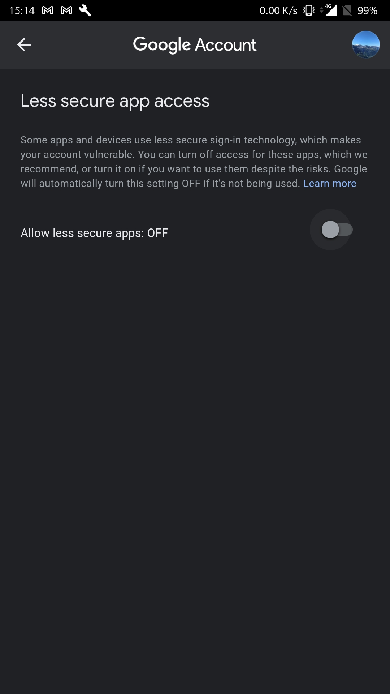

# Use Gmail with Telnet

_Actually, telnet does not really work with gmail... Despite there is a `telnet-ssl` package._
_That said, it is still possible to send an email using command lines and SSL_

# Base64

First, we must convert our login and password in base64.

```python
> python3
Python 3.6.9 (default, Oct  8 2020, 12:12:24) 
[GCC 8.4.0] on linux
Type "help", "copyright", "credits" or "license" for more information.
>>> import base64
>>> msg_login = "my_login"
>>> msg_passwd = "my_passwd"
>>> msg_login_2byte = msg_login.encode('ascii')
>>> msg_login
'my_login'
>>> msg_login_2byte
b'my_login'
>>> msg_passwd_2byte = msg_passwd.encode('ascii')
>>> msg_passwd_b64 = base64.b64encode(msg_passwd_2byte)
>>> msg_passwd_b64
b'bXlfcGFzc3dk'
>>> msg_login_b64 = base64.b64encode(msg_login_2byte)
>>> msg_login_b64
b'bXlfbG9naW4='
>>> base64.b64decode(msg_login_b64)
b'my_login'
>>> base64.b64decode(msg_login_b64).decode()
'my_login'
>>> base64.b64decode(msg_passwd_b64).decode()
'my_passwd'
>>> 
```

## Encode login and password

```python
> python3
Python 3.6.9 (default, Oct  8 2020, 12:12:24) 
[GCC 8.4.0] on linux
Type "help", "copyright", "credits" or "license" for more information.
>>> import base64
>>> base64.b64encode("my_login".encode())
b'bXlfbG9naW4='
>>> base64.b64encode("my_login".encode('ascii'))
b'bXlfbG9naW4='
>>> base64.b64encode("my_password".encode('ascii'))
b'bXlfcGFzc3dvcmQ='
>>> 
```

### Straight forward encoding

```bash
user user-pc:~ > python3 -c 'import base64; m_login = base64.b64encode("my_login".encode("ascii")); print(m_login)'
b'bXlfbG9naW4='
user user-pc:~ > python3 -c 'import base64; m_login = base64.b64encode("my_password".encode("ascii")); print(m_login)'
b'bXlfcGFzc3dvcmQ='
user user-pc:~ > 
```

> As a result, \
> login : `bXlfbG9naW4=` for `my_login` \
> password : `bXlfcGFzc3dvcmQ=` for `my_password`

### Straight forward decoding

```bash
user user-pc:~ > python3 -c 'import base64; m_login = base64.b64encode("my_password".encode("ascii")); print(m_login)'
b'bXlfcGFzc3dvcmQ='
user user-pc:~ > python3 -c "import base64; m_login = base64.b64decode(b'bXlfcGFzc3dvcmQ=').decode(); print(m_login)"
my_password
user user-pc:~ > 
```

# Gmail policy



# Connection and SMTP protocol

## step 1
```bash
openssl s_client -starttls smtp -connect smtp.gmail.com:587 -crlf -ign_eof
```

## step 2

```
EHLO titi
```

## step 3
```
AUTH LOGIN
```

> Server respone : `334 VXNlcm5hbWU6`
> Server wants us to give it our login in `base64`

_It's time to user our encoded login and password we have seen_

> login : `bXlfbG9naW4=` for `my_login` \
> password : `bXlfcGFzc3dvcmQ=` for `my_password`

```bash
bXlfbG9naW4=
```

```bash
bXlfcGFzc3dvcmQ=
```

> (!) if it does not work, check gmail policy and activate !!

## step 4
```
MAIL FROM:<titi@gmail.com>
```
```
RCPT :<tutu@gmail.com>
```

> Respect format !! `<my@gmail.com>` with `<` and `>`

```
DATA
```

```
This is my message
```

```

.
````

> One dot to end our message \
> It indicates to send our message !!

## step 5

```
QUIT
```

**IMPORTANT**

> Do not forget to activate policy AGAIN (and thus protect our mail box :)

## `base64` server messages

```bash
> python3 -c "import base64; msg_server = base64.b64decode(b'VXNlcm5hbWU6').decode(); print(msg_server)"
Username:
blackpc blackpc-pc:~ 
> 
```


# Biblio

- [gmail authentication](https://support.google.com/accounts/answer/185833)
- [gmail third-party-app](https://support.google.com/mail/answer/7126229?p=WantAuthError&visit_id=637422539883685943-2797466915&rd=2#cantsignin)
- [encoding base64](https://stackabuse.com/encoding-and-decoding-base64-strings-in-python/)
- [send an email](http://furie.be/news/38/15/Tester-le-SMTP-de-Gmail-via-Telnet.html)