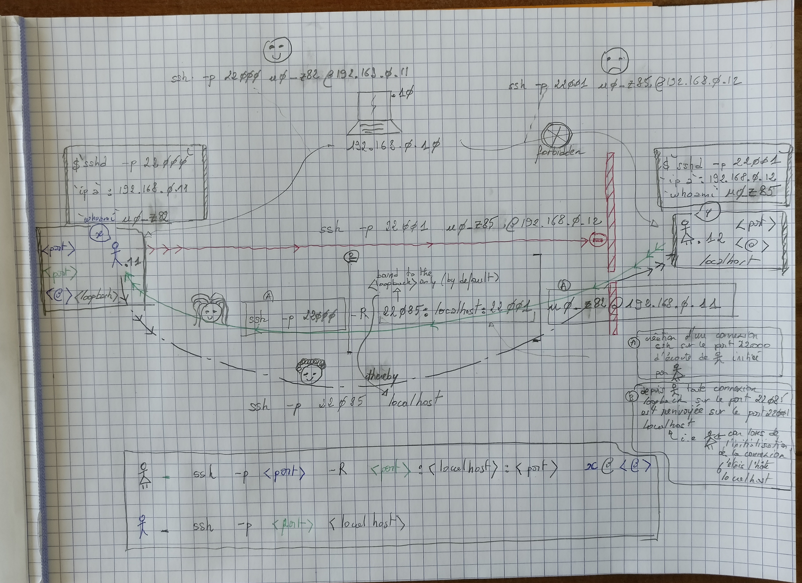

# SSH port forwarding

## `man ssh`

## Tunnel `sortant`

```bash
     -L [bind_address:]port:host:hostport
     -L [bind_address:]port:remote_socket
     -L local_socket:host:hostport
     -L local_socket:remote_socket
             Specifies that connections to the given TCP port or Unix socket on the local (client) host are to be forwarded to
             the given host and port, or Unix socket, on the remote side.  This works by allocating a socket to listen to either
             a TCP port on the local side, optionally bound to the specified bind_address, or to a Unix socket.  Whenever a con‐
             nection is made to the local port or socket, the connection is forwarded over the secure channel, and a connection
             is made to either host port hostport, or the Unix socket remote_socket, from the remote machine.

             Port forwardings can also be specified in the configuration file.  Only the superuser can forward privileged ports.
             IPv6 addresses can be specified by enclosing the address in square brackets.

             By default, the local port is bound in accordance with the GatewayPorts setting.  However, an explicit bind_address
             may be used to bind the connection to a specific address.  The bind_address of “localhost” indicates that the lis‐
             tening port be bound for local use only, while an empty address or ‘*’ indicates that the port should be available
             from all interfaces.
```

## Tunnel `entrant`

```bash
     -R [bind_address:]port:host:hostport
     -R [bind_address:]port:local_socket
     -R remote_socket:host:hostport
     -R remote_socket:local_socket
     -R [bind_address:]port
             Specifies that connections to the given TCP port or Unix socket on the remote (server) host are to be forwarded to
             the local side.

             This works by allocating a socket to listen to either a TCP port or to a Unix socket on the remote side.  Whenever a
             connection is made to this port or Unix socket, the connection is forwarded over the secure channel, and a connec‐
             tion is made from the local machine to either an explicit destination specified by host port hostport, or
             local_socket, or, if no explicit destination was specified, ssh will act as a SOCKS 4/5 proxy and forward connec‐
             tions to the destinations requested by the remote SOCKS client.

             Port forwardings can also be specified in the configuration file.  Privileged ports can be forwarded only when log‐
             ging in as root on the remote machine.  IPv6 addresses can be specified by enclosing the address in square brackets.

             By default, TCP listening sockets on the server will be bound to the loopback interface only.  This may be overrid‐
             den by specifying a bind_address.  An empty bind_address, or the address ‘*’, indicates that the remote socket
             should listen on all interfaces.  Specifying a remote bind_address will only succeed if the server's GatewayPorts
             option is enabled (see sshd_config(5)).

             If the port argument is ‘0’, the listen port will be dynamically allocated on the server and reported to the client
             at run time.  When used together with -O forward the allocated port will be printed to the standard output.
```

## Shéma de principe


## Cas pratique



### Scénario (cas tunnel renversé `-R` ou entrant)

Etant données les données présentes sur le schéma `x -> y`

- y tape la commande `ssh -p 22000 -R 22085:localhost:22001 u0_z82@192.168.0.11`

> créé une connexion SSH entre y et x sur le port `22000` initiée par y \
> créé un tunnel tel que

> - étant loggé sur `u0_z82@192.168.0.11`
> - toute connexion SSH adressée à localhost (loopback `127.0.0.1` de l'hôte `192.168.0.11)` sur le port `22085` sera redirigée sur le port `22001` de localhost qui a créé le tunnel (.i.e `192.168.0.12`)
> - sur l'hôte 192.168.0.11, par défaut, seule l'interface `loopback` est en écoute (ce qui explique la suite... `ssh -p 22085 localhost`)

- x tape la commande `ssh -p 22085 localhost`

> ce qui a pour effet de traverser le tunnel pour rejoindre `192.168.0.12` sur le port `22001`


## Biblio

- [linux-france schéma](http://www.linux-france.org/prj/edu/archinet/systeme/images/ssh-redirect.png)
- [fedora hôte visé résolution](https://doc.fedora-fr.org/wiki/Tunnels_SSH)
